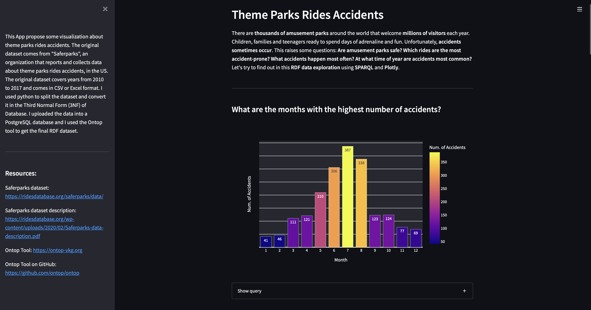
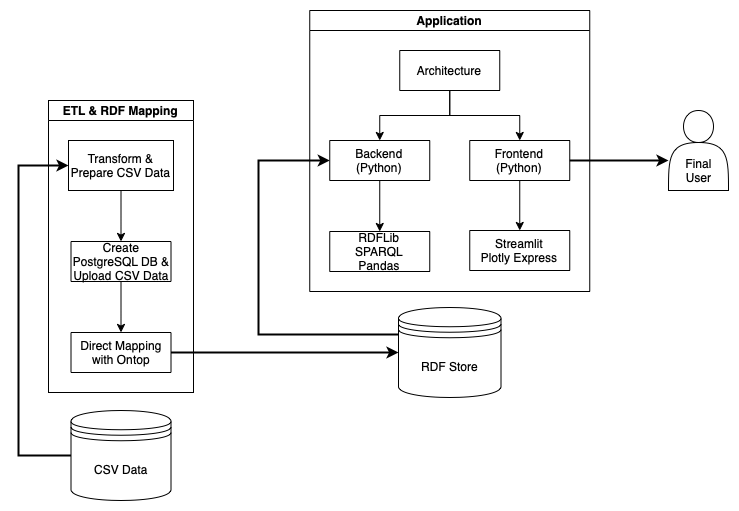
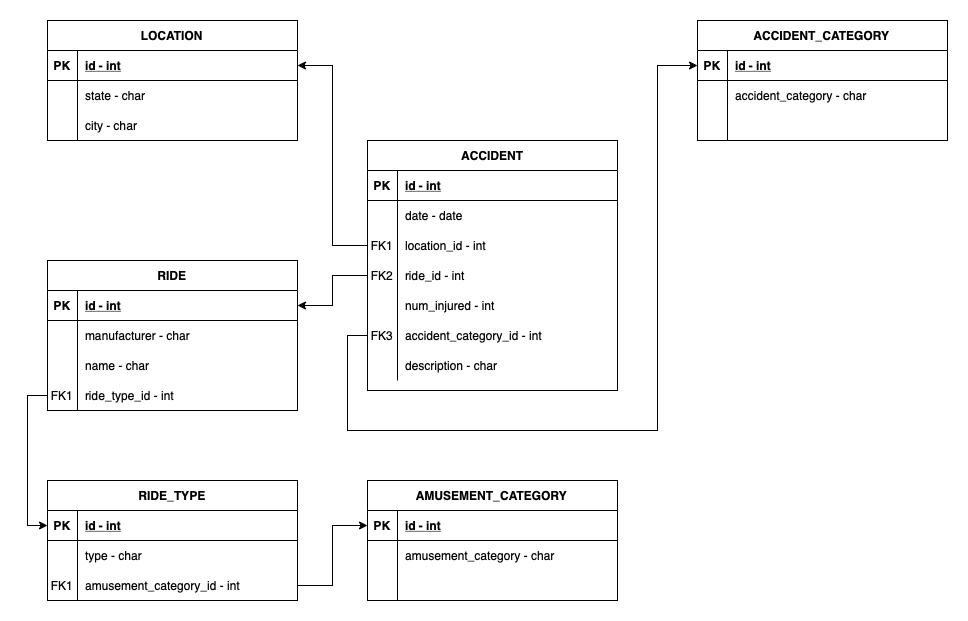

# Theme Park Ride Accidents Analysis



## Overview

A running version of the application is [hosted on my Huggingface](https://huggingface.co/spaces/EdBianchi/ThemeParksAccidents_RDF-SPARQL).

The purpose of this project is to build a system that uses Semantic Web and Linked Data technologies to analyze accidents occurred in theme parks in the United States. The original Excel dataset can be found on the Saferparks Dataset page. This dataset will be split and modified so that it can be loaded into a Third Normal Form (3FN) PostgreSQL database using PSQL, and converted into the RDF format using the Ontop tool. A final webapp is presented to the user. The app is built with Streamlit and includes several charts and parametric queries. 

The following image depicts the system architecture and all the components:



## Data Sources

The dataset used in this project comes from Saferparks. Saferparks is an organization that aims to limit and prevent accidents in theme parks. Although this organization is no longer research-active, it continues to share data collected over the years. Specifically, the dataset
used for this project contains data from accidents that occurred between 2010 and 2017, in parks across the United States. Accident data contains information on accident categories, people involved, and rides involved. Spatial and temporal data are also present.


## Technologies

1. **RDFLib**: This Python library is designed to work with RDF. It provides the ability to load, save, and navigate RDF graphs. It is also possible to query graphs with SPARQL.
2. **SPARQL**: SPARQL is the query language used to query the RDF graph.
3. **Ontop**: Ontop is a tool used to map a relational database source to an RDF data source.
4. **Streamlit**: Streamlit is an open-source Python framework used to develop simple but effective web apps. Streamlit provides a set of components that can be placed on the pages of the application. These components range from titles to user inputs, dataframes, and graphs. Creating an app with Streamlit is easy and doesn't require any front-end experience. The backend of the app is written in plain Python, and the frontend is generated using Streamlit-specific functions. These functions render elements (title, text, charts, results, …) on the app page(s).
5. **Plotly Express**: This Python library is used to create figures and visualizations.
6. **Huggingface**: Hugging Face is an AI-oriented community. On their website, they host tons of models, datasets, and spaces. Users can create spaces for free to host and share their applications. Apps to share must be developed using Gradio or Streamlit.
7. **PostgreSQL + pgAdmin 4**: Tools used to create \& operate the database, and load data from CSV tables.


## Development Stages

1. Get the dataset about accidents from Saferparks.
2. Prepare the data: selecting the attributes of interest, split the dataset, export transformed CSV tables.
3. Create a PostgreSQL database and upload the data from the exported tables.
4. Use the Ontop tool to map the relational database and materialize the final RDF dataset.
5. Use SPARQL to query the RDF and plot the results on a web app made with Streamlit.

Steps 2 and 3 are referred as Extract, Transform, Load (ETL). All the steps are briefly
explained in the following sections


### Data Preparation

To prepare the data, I used a Jupyter Notebook. In particular, I used the Pandas library to split the dataset into different tables while maintaining referential constraints. The purpose is to export CSV tables ready to be loaded into a PostgreSQL database. The Third Normal Form (3FN) should be respected. The notebook with all the operations is contained in the project repository at *data/data_preparation.ipynb*. The tables exported to CSV are also present in the *data/prepared_data* folder.

### Database Creation & Population

The mapping functionality provided by the Ontop tool requires data to be in a relational database. For this purpose, I created a custom PostgreSQL database with all the required tables and constraints. Database tables are created using the SQL DDL language. The PSQL tools is used to populate the tables uploading data from the CSV tables generated during the *Data Preparation* step.

The following figure represents the database schema:




### Mapping & Materializing the RDF

After loading the data into the dataset, I used the Ontop tool to generate the RDF dataset. In particular, the conversion is done with an R2RML mapping, that specifies a mapping from a relational database to RDF (RDB to RDF).


## Running the Application

A running version of the application is [hosted on my Huggingface](https://huggingface.co/spaces/EdBianchi/ThemeParksAccidents_RDF-SPARQL).

Alternatively, one can run the application locally. In this case, please note that the proposed Command Line Interface (CLI) commands may vary depending on the platform used.This application was developed and tested is osx-arm64 and it may be necessary to install / remove additional libraries to make the application work on other platforms.

* The first step is to run the app locally, is clone this repository and make sure to have all the requisites necessary to use the application. To simplify this operation we can create a new virtual environment and install the required libraries. The `conda_env.txt` file contains all the required libraries in a format that is ready to install in an Anaconda Virtual Environment.

This operation can be done from the Command Line Interface (CLI) with the following command:
```bash
# navigate to the cloned folder
$ conda create --name my-env --file conda_env.txt
$ conda activate my-env
```

* Next, launch the actual application using Streamlit. This can be done easily with:

```bash
(my-env) $ streamlit run app.py
```

if the command is executed correctly, it will open a browser page with the application running.
To stop the application, simply close the terminal running Streamlit.


## Functionalities & App Structure

The basic structure has eight sections, six of which are visualizations. Specifically:

* **Accident Monthly Analysis**: Represents the months with the highest number of accidents.
* **Accidents Geographic Analysis**: Represents states and cities where more accidents occur.
* **Description of Accidents occurred on a Particular Ride**: This parametric query allows the user to select a ride from a list of rides and returns a variable number of accidents occurred on that ride. The number of results is selected using a slider.
* **Most Common Accidents**: Represents the most common types of accidents.
* **Most Dangerous Ride Categories**: Represents the categories of rides on which the most accidents occur.
* **Most Dangerous Ride Types**: Represents the types of rides on which the most accidents occur.
* **People Involved in Accidents**: Represents the number of injured people that are generally involved in an accident.
* **Customizable Query**: Allows the user to type in a personalized query and see the results in a tabular format.


## REFERENCES & Links
[Saferparks](https://ridesdatabase.org/saferparks)

[SPARQL](https://www.w3.org/TR/rdf-sparql-query/)

[Ontop](https://ontop-vkg.org)

[Plotly Express](https://plotly.com/python/plotly-express/)

[RDFLib](https://rdflib.readthedocs.io/en/stable/)

